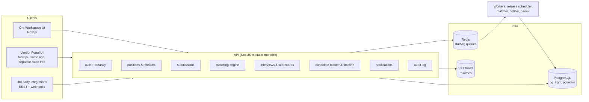

# 02 — System Architecture

> **Implementation status (2026-07-31):** the monolith, tenancy guards,
> entitlements, session auth, matching engine, and web app are built. Not yet
> built from this doc: BullMQ workers (Redis is behind a compose profile until
> then — release **email notification** uses a DB-is-truth in-process sweeper
> meanwhile), S3/MinIO file storage, webhooks, OIDC SSO, OpenAPI publication,
> and the Postgres **row-level-security backstop** (currently enforcement is
> guard + query layer; RLS remains a planned defense-in-depth layer).

## 1. Shape: modular monolith, API-first

For an open-source project that wants contributors, a **modular monolith** beats microservices: one repo, one deploy, one database, fast local setup — while keeping module boundaries strict enough to split later if ever needed.



## 2. Tech stack & rationale

| Layer | Choice | Why |
|---|---|---|
| Language | TypeScript everywhere | Largest contributor pool; shared types between API and UI |
| API | **NestJS** | Opinionated module structure keeps a monolith modular; DI makes the matching engine and parsers pluggable; first-class OpenAPI generation |
| ORM | **Prisma** | Approachable for contributors; migrations in-repo; escape hatch to raw SQL for matching queries |
| Web | **Next.js** + shadcn/ui + TanStack Query | One app hosting two route trees: `/app` (org) and `/vendor` (portal); shared component library |
| DB | **PostgreSQL 16** | `pg_trgm` (fuzzy names), generated columns for normalized identifiers, row-level tenancy; `pgvector` optional for resume similarity |
| Queue/jobs | **BullMQ + Redis** | Release scheduling (delayed jobs), matching pipeline, notifications, resume parsing |
| Files | S3-compatible (MinIO self-host) | Resume storage with presigned URLs; AV scan hook (ClamAV container optional) |
| Auth | **Auth.js-style credential + OIDC SSO (pluggable)** | Self-host friendly; org SSO later via OIDC; vendor users always credential/magic-link |
| Email | SMTP (self-host) with provider adapters | Notifications without SaaS lock-in |
| Deploy | Docker Compose (dev/eval), Helm chart (M4) | One-command evaluation is an adoption requirement |

**Deliberate non-choices:** no Elasticsearch (Postgres FTS + trgm is enough at target scale; add OpenSearch behind an interface only if needed), no Keycloak by default (heavy for small self-hosts; OIDC adapter allows it for those who want it), no mandatory LLM (matching and parsing have pure-algorithmic defaults; LLM/embedding providers are optional plugins).

## 3. Monorepo layout

```
intervu/
├── apps/
│   ├── api/                  # NestJS
│   │   └── src/modules/
│   │       ├── auth/         # sessions, OIDC, invitations
│   │       ├── tenancy/      # org & vendor scoping guards
│   │       ├── positions/    # positions, pipelines, release policies
│   │       ├── releases/     # scheduler + vendor visibility
│   │       ├── vendors/      # vendor CRUD, contracts, tiers
│   │       ├── submissions/  # vendor submissions, ownership rules
│   │       ├── candidates/   # master records, identities, timeline
│   │       ├── matching/     # engine: normalizers, scorers, review queue
│   │       ├── interviews/   # rounds, panels, scheduling
│   │       ├── scorecards/   # templates, responses, visibility policy
│   │       ├── files/        # resumes, presigned URLs, AV hook
│   │       ├── notifications/
│   │       ├── webhooks/
│   │       └── audit/
│   └── web/                  # Next.js
│       └── src/app/
│           ├── (org)/        # org workspace routes
│           └── (vendor)/     # vendor portal routes
├── packages/
│   ├── contracts/            # zod schemas + generated OpenAPI types (shared)
│   ├── matching-core/        # pure functions: normalizers, similarity, scoring
│   │                         #   (no DB deps → unit-testable, reusable, the most
│   │                         #    contributor-friendly package in the repo)
│   └── ui/                   # shared shadcn-based components
├── infra/
│   ├── docker-compose.yml    # postgres, redis, minio, api, web, worker
│   └── helm/                 # (M4)
└── docs/
```

## 4. Multi-tenancy & authorization model

### Deployment model: one deployment = one organization (ADR)

**Decision:** the supported deployment model is **a single organization per
deployment**. `organization_id` stays on every row, so a deployment *can*
technically hold several organizations, but hosting **mutually distrusting**
organizations together is explicitly **not supported** today.

Why not full SaaS multi-tenancy:

- The product's value — candidate history, vendor ownership disputes, panel
  matching — is entirely *within* one organization. Co-mingling companies buys
  nothing functionally.
- It would raise the security bar sharply: Postgres **RLS becomes mandatory**
  rather than a planned backstop, and per-tenant backup/restore, rate limits,
  data residency and blast-radius controls all become table stakes.
- Self-hosting one org per deployment is cheap (one compose stack) and gives
  each organization its own database, backups and upgrade cadence.

What multi-org *is* good for today: a single operator running several
organizations they themselves control (e.g. subsidiaries), where the trust
boundary between them is soft. Anyone wanting true hostile-tenant isolation
should run one deployment per organization until RLS lands.

Two nested tenancy dimensions:

1. **Organization** — every row carries `organization_id`; sessions are bound to exactly one organization.
2. **Vendor** — vendor-side users additionally carry `vendor_id`; vendor-scoped queries are *always* filtered by both `organization_id` **and** `vendor_id`, and vendors authenticate **per organization** (docs/05 §1).

Enforcement is layered — defense in depth:

- **Guard layer (NestJS):** every request resolves a `TenantContext { orgId, vendorId?, roles }` from the session; controllers declare required scope (`@OrgScope()`, `@VendorScope()`).
- **Repository layer:** Prisma client extension injects tenant filters into every query; a query without a tenant filter throws in CI.
- **Database layer:** Postgres **row-level security** policies as a backstop (`current_setting('app.org_id')`, `app.vendor_id`), enabled on vendor-visible tables. Belt and suspenders — an ORM bug must not become a cross-vendor leak.
- **Test layer:** a dedicated cross-tenant leakage test suite (fixtures with 2 orgs × 3 vendors) runs in CI against every endpoint.

### Role model (RBAC, simple by design)

`org_admin`, `recruiter`, `hiring_manager`, `interviewer` (org side); `vendor_admin`, `vendor_recruiter` (vendor side). Fine-grained rules that don't fit RBAC (e.g., "interviewers see feedback only after submitting their own") are **policy flags on the org settings**, evaluated in the service layer — not a full ABAC engine in v1.

### Vendor data wall (hard rules)

| Data | Vendor sees |
|---|---|
| Positions | Only those released to their vendor, only while open |
| Submissions | Only their own |
| Candidate status | Coarse mapped status only (`Submitted → Screening → Interviewing → Offered / Rejected / Withdrawn`) |
| Duplicate rejection | "Not eligible: candidate already in process from another source" — never *which* source |
| Internal data | Never: interviewer identities, scorecards, history, other vendors, tier structure |

## 5. Background jobs (BullMQ queues)

| Queue | Trigger | Work |
|---|---|---|
| `release` | Position published with tiered policy | Delayed jobs per tier flip `position_vendor_release.visible_from`; idempotent; survive restarts (jobs derived from DB state, Redis is a cache of intent) |
| `matching` | Submission created/updated; candidate edited | Run pipeline from [04-candidate-matching.md](04-candidate-matching.md); write match links or review-queue items |
| `parse` | Resume uploaded | Extract text + contact fields (feeds matcher); store parsed doc |
| `notify` | Domain events | Email/webhook fan-out with retry + dead-letter |
| `retention` | Nightly cron | Enforce retention policy, process erasure requests |

**Scheduler correctness rule:** Redis jobs are *triggers*, the DB is *truth*. The release worker re-reads the release row and applies `visible_from = min(existing, now)` — releases only ever widen visibility; re-running is harmless.

## 6. Domain events, audit, webhooks

All modules emit typed domain events (`position.released`, `submission.created`, `candidate.merged`, `interview.completed`, `decision.recorded`, …) on an in-process event bus. Three subscribers:

1. **Audit** — append-only `audit_log` row (actor, entity, before/after diff, request id). No deletes; erasure redacts payload PII but keeps the event skeleton.
2. **Notifications** — user-facing email/in-app.
3. **Webhooks** — org-configured endpoints, HMAC-signed, with retry/backoff and delivery log.

## 7. Observability & ops

- OpenTelemetry traces + Prometheus `/metrics` endpoint out of the box.
- Health checks per dependency (`/healthz`: db, redis, s3).
- Structured JSON logs; request ids propagate into audit rows.
- Seed script generates a demo org (2 teams, 5 positions, 3 vendors, 200 candidates with planted duplicates) so evaluators see the matching engine work within minutes of `docker compose up`.
