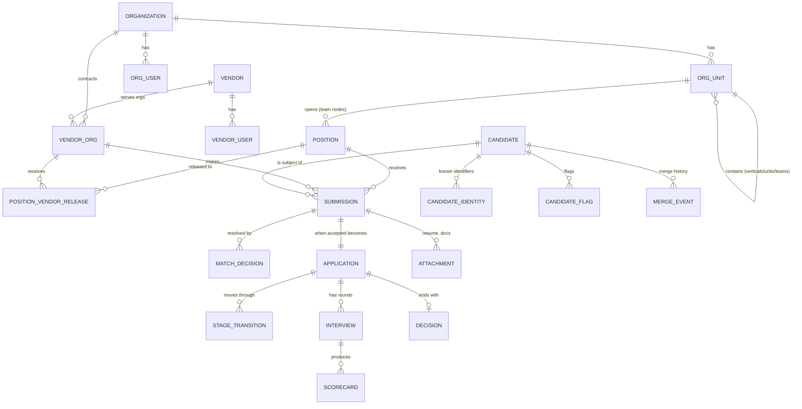

# 03 — Data Model

The pivotal modeling decision: **a candidate is not a submission.** A `candidate` is the org-scoped master identity ("golden record"). A `submission` is one vendor putting one candidate forward for one position at one time. Matching links submissions to candidates; history is the set of everything hanging off the candidate.

## 1. Entity-relationship overview



Key distinction: `SUBMISSION` (vendor's act, subject to ownership rules) vs `APPLICATION` (the org's pipeline instance for a candidate on a position). A duplicate submission may be recorded and flagged *without* creating a second application.

## 2. Tables (abridged; authoritative schema lives in Prisma migrations)

Conventions: `id uuid pk`, `created_at/updated_at`, `organization_id` on every org-scoped table (omitted below for brevity). Soft-delete only where noted; audit log covers history.

### Tenancy & people

```sql
organization(id, name, slug, settings jsonb)
  -- settings: feedback_visibility_policy, ownership_window_days,
  --           ownership_scope ('position'|'organization'), coarse_status_map, retention

org_unit(id, parent_id?, name, kind)                  -- kind: unit|team; self-referential tree
  -- Organizations structure themselves as a hierarchy: verticals/units contain
  -- other units or teams, to any depth (e.g. Org → Engineering → Platform).
  -- Positions attach only to kind='team' nodes. parent must be same-org (app-enforced).
  -- unique (organization_id, parent_id, name)

org_user(id, email, name, auth_provider, status)
org_membership(org_user_id, org_unit_id?, role)       -- role: org_admin|recruiter|hiring_manager|interviewer
  -- org_unit_id null = org-wide membership. A membership scoped to a unit
  -- applies to that node and all descendants (a vertical-level hiring_manager
  -- sees every team under the vertical).

vendor(id, name)                                      -- global vendor identity
vendor_org(id, vendor_id, tier smallint, status,      -- the org↔vendor relationship
           contract_start, contract_end)              -- tier drives tiered release
vendor_user(id, vendor_id, email, name, role, status) -- role: vendor_admin|vendor_recruiter
```

### Positions & release

```sql
position(id, org_unit_id, title, description, openings, status,    -- draft|open|paused|closed
         seniority, employment_type, location_policy, location_text,
         min_total_years, rate_min, rate_max, rate_currency,       -- rate band is vendor-facing
         rate_period, must_haves jsonb,                            -- non-skill screening reqs
         created_by)                                               -- org_unit must be kind='team'

release_policy(id, position_id, mode,                              -- all_at_once|tiered|manual
               config jsonb)
  -- tiered config: [{tier:1, delay_hours:0},{tier:2, delay_hours:168}, ...]

position_vendor_release(id, position_id, vendor_org_id,
                        visible_from timestamptz,                  -- the gate: vendor sees position iff now() >= visible_from and position open
                        released_by, source)                       -- source: policy|manual
```

### Candidates & identity

```sql
candidate(id, display_name, primary_email_norm, primary_phone_norm,
          current_title, current_employer, location, summary,
          resume_attachment_id?,                                   -- latest
          erasure_status)                                          -- active|erasure_requested|erased

candidate_identity(id, candidate_id, kind,                         -- email|phone|linkedin|external_id|gov_id_hash
                   value_norm text, value_raw text,
                   source_submission_id?,
                   unique (organization_id, kind, value_norm))     -- one identifier → one candidate

candidate_flag(id, candidate_id, kind,                             -- do_not_hire|caution|note
               reason, created_by, expires_at?, visibility)        -- visibility: admins|recruiters|all_org

merge_event(id, surviving_candidate_id, merged_candidate_id,
            performed_by, mode,                                    -- auto|manual
            snapshot jsonb,                                        -- full pre-merge state → enables un-merge
            reversed_at?, reversed_by?)
```

### Submissions, ownership, matching

```sql
submission(id, position_id, vendor_org_id, vendor_user_id,
           candidate_id?,                                          -- set by matching (null while pending review)
           raw_profile jsonb,                                      -- exactly what the vendor typed
           status,                                                 -- received|matched|pending_review|accepted|duplicate|rejected|withdrawn
           ownership_status,                                       -- owner|duplicate|arbitrated_owner|not_applicable
           received_at timestamptz,                                -- ownership tie-breaker (server clock)
           expected_rate?, vendor_notes?)

match_decision(id, submission_id, candidate_id?,
               outcome,                                            -- auto_linked|auto_new|reviewed_linked|reviewed_new
               score numeric, feature_breakdown jsonb, decided_by?)-- null decided_by = engine

match_review_item(id, submission_id, candidate_id_suggested,
                  score, feature_breakdown jsonb,
                  status,                                          -- open|linked|kept_separate
                  resolved_by?, resolved_at?)
-- candidate additionally carries merged_into_id: set when the record was
-- merged into another master; kept (empty) for exact un-merge, excluded from
-- blocking and lists. session(token_hash unique, org_user_id?/vendor_user_id?,
-- expires_at) backs cookie auth.
```

### Skills & panels

```sql
skill(id, name, name_norm)                             -- org-scoped taxonomy
position_skill(position_id, skill_id, level,           -- level: must_have|good_to_have
               proficiency, min_years)                 -- proficiency: awareness|working|proficient|expert
                                                       -- importance and proficiency are separate axes
panel(id, org_unit_id?, name, description)             -- panelist pool for a technology area;
                                                       -- scope: null=org-wide, else unit/team node
                                                       -- + descendants (same pattern as memberships)
panel_skill(panel_id, skill_id)
panel_member(panel_id, org_user_id)
-- Suggestion ranking: panels whose scope is ancestor-or-self of the position's
-- team; member score = Σ matched skills (must_have=2, good_to_have=1)
```

### Pipeline, interviews, feedback

```sql
application(id, position_id, candidate_id,
            source_submission_id,                                  -- the owning submission
            current_stage, status)                                 -- active|hired|rejected|withdrawn
  -- unique (position_id, candidate_id): one pipeline per candidate per position

stage_transition(id, application_id, from_stage, to_stage, by, note)

interview(id, application_id, round_name, scheduled_at, duration_min,
          location_or_link, status)                                -- scheduled|completed|canceled|no_show
interview_panelist(interview_id, org_user_id, role)                -- interviewer|shadow

scorecard_template(id, name, sections jsonb)                       -- structured criteria + rating scale
scorecard(id, interview_id, org_user_id, template_id,
          responses jsonb, overall_rating, recommendation,         -- strong_yes|yes|no|strong_no
          submitted_at)
  -- visibility policy (hide-until-submitted) enforced in service layer

decision(id, application_id, outcome,                              -- offer|reject|hold
         reason, decided_by, decided_at)
```

### Files, audit, notifications

```sql
attachment(id, kind,                                               -- resume|other
           owner_type, owner_id,                                   -- polymorphic: submission|candidate
           s3_key, filename, content_type, size, av_status,
           parsed_text?, parsed_fields jsonb?)

audit_log(id, actor_type, actor_id, event, entity_type, entity_id,
          payload jsonb, request_id, at timestamptz)               -- append-only

webhook_endpoint(id, url, secret, events text[])
webhook_delivery(id, endpoint_id, event, payload jsonb, status, attempts, last_error)

notification(id, recipient_type, recipient_id, event, payload jsonb, read_at?)
```

## 3. Indexes & Postgres specifics that make matching work

```sql
-- Deterministic lookups
create unique index on candidate_identity (organization_id, kind, value_norm);

-- Fuzzy name candidate generation (blocking)
create extension pg_trgm;
create index candidate_name_trgm on candidate
  using gin (display_name gin_trgm_ops);

-- Phonetic blocking key (dmetaphone via fuzzystrmatch), stored generated column
alter table candidate add column name_phonetic text
  generated always as (dmetaphone(display_name)) stored;
create index on candidate (organization_id, name_phonetic);

-- Optional semantic similarity (M3+)
create extension if not exists vector;
alter table candidate add column resume_embedding vector(768);
create index on candidate using hnsw (resume_embedding vector_cosine_ops);
```

## 4. The candidate timeline (the "history" requirement)

The timeline is a read model assembled per candidate, permission-filtered per viewer:

| Event source | Timeline entry |
|---|---|
| `submission` | "Submitted by *Vendor X* for *Position P* on *date* (status)" — vendor name visible to org users only |
| `stage_transition` | pipeline movement |
| `interview` + `scorecard` | round, panel, ratings, recommendations (subject to feedback-visibility policy) |
| `decision` | outcome + reason |
| `candidate_flag` | flags (visibility-scoped) |
| `merge_event` | "Profile merged from a duplicate record" (admins see details) |

Implemented as a SQL view/union in v1 (no denormalized event store needed at target scale); can become a materialized projection later without API change.

## 5. Ownership evaluation (summarized; full rules in [05](05-vendor-portal-and-release.md))

On successful match of submission → candidate:

```
scope   = org.settings.ownership_scope           -- 'position' (default) or 'organization'
window  = org.settings.ownership_window_days     -- default 180
owner   = earliest submission for (candidate, scope) with
          status not in (rejected_invalid, withdrawn)
          and received_at >= now() - window
if this submission is that earliest → ownership_status = owner
else → ownership_status = duplicate  (+ duplicate flag event to recruiters; vendor sees "not eligible")
Recruiters may override → arbitrated_owner (audited, reason required).
```
