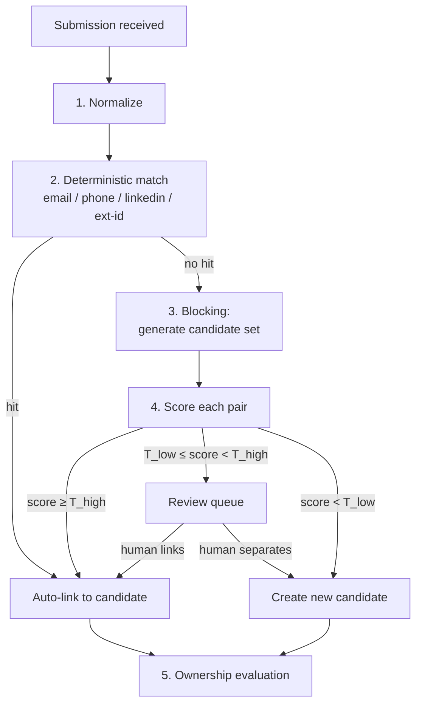

# 04 — Candidate Matching Engine (Identity Resolution)

The matching engine answers one question on every submission: **is this person already known to this organization?** It must be conservative (a wrong merge leaks one person's interview history into another's packet), explainable (recruiters must see *why* two records matched), and cheap (runs synchronously enough that vendors get instant duplicate feedback).

## 1. Design principles

1. **Never destructive by default.** Auto-*link* is allowed at very high confidence; auto-*merge* of two existing masters is never automatic — always a human.
2. **Explainable scores.** Every decision stores a per-feature breakdown (`match_decision.feature_breakdown`), rendered in the review UI.
3. **Pure core.** All normalizers/similarity/scoring live in `packages/matching-core` with zero DB dependencies — unit-testable, fuzz-testable, and the easiest place for new contributors to work.
4. **Pluggable stages.** Embedding similarity and LLM adjudication are optional providers behind interfaces; the default pipeline is fully algorithmic and offline.

## 2. Pipeline

### Stage 1 — Normalization (`matching-core/normalize`)

| Field | Normalization |
|---|---|
| Email | lowercase, trim; strip `+tag`; provider dot-stripping (gmail) **configurable, default on**; store raw + norm |
| Phone | E.164 via libphonenumber with org default region; compare last-10-digits as fallback key |
| Name | Unicode NFKC, casefold, strip honorifics/suffixes, collapse whitespace; token-sort form; phonetic form (double metaphone) |
| LinkedIn/URLs | canonical host + path, strip tracking params |
| Location | geonames-lite normalization to city/region (coarse feature only) |

### Stage 2 — Deterministic match

Exact hit on `candidate_identity (kind, value_norm)` for `email`, `phone`, `linkedin`, `external_id` → **auto-link** (`outcome = auto_linked`, score 1.0). New identifiers from the submission (e.g., a second email) are appended to the candidate's identity set — identities accrete over time, which is exactly how the "same candidate, different vendor, different email" case eventually becomes deterministic.

Collision guard: if the submission's identifiers hit **two different candidates** (email → candidate A, phone → candidate B), do *not* pick one — create a review item proposing an A↔B merge and link the submission provisionally to the stronger hit.

### Stage 3 — Blocking (candidate generation)

Never score against the whole table. Union of:

- `name_phonetic` equality (indexed)
- trigram name similarity `similarity(display_name, :name) > 0.45` (GIN index)
- shared normalized employer + same coarse location
- (M3+) top-20 nearest resume embeddings

Cap block size (default 50) with a metric on overflow.

### Stage 4 — Pairwise scoring

Weighted feature model (weights configurable per org, defaults below), producing `score ∈ [0,1]`:

| Feature | Similarity | Default weight |
|---|---|---|
| Name | Jaro-Winkler on token-sorted norm; phonetic-equal bonus | 0.30 |
| Email local-part | Jaro-Winkler (cross-domain) | 0.15 |
| Phone | exact-last-10 binary | 0.15 |
| Employer history overlap | Jaccard on normalized employers | 0.12 |
| Title similarity | trigram | 0.05 |
| Location | same city / region / country tiers | 0.05 |
| Resume text | MinHash/shingle Jaccard (default) or embedding cosine (optional) | 0.15 |
| DOB / gov-id hash (if collected) | exact binary — near-deterministic boost | 0.03→overrides |

Thresholds (org-tunable): `T_high = 0.92` auto-link, `T_low = 0.70` review-queue floor. **Guard rule:** score composed *only* of name+location features can never reach `T_high` regardless of weights — common-name protection is structural, not tuned.

### Stage 5 — Ownership evaluation

Runs after link/new (see [03 §5](03-data-model.md) and [05 §4](05-vendor-portal-and-release.md)). Emits `submission.duplicate_flagged` when applicable.

## 3. Review queue (human-in-the-loop)

Recruiters/admins get a queue of `match_review_item`s with a side-by-side diff: identifiers, employment timeline, resumes, feature breakdown with per-feature bars, and both records' history. Actions:

- **Link** → submission joins existing candidate; new identifiers accrete; decision recorded with reviewer id.
- **Keep separate** → new candidate created; the *pair* is remembered as a negative example (`kept_separate`) so the engine stops re-asking (and negatives become future training data).
- **Merge masters** (admin-only) → for when two existing candidates are discovered to be one person. Snapshot stored in `merge_event` → **un-merge** restores the pre-merge state and re-links children.

SLA hint: submissions in `pending_review` block vendor-facing duplicate feedback, so the queue surfaces age prominently and notifies on breach (default 24h).

## 4. Re-matching triggers

Matching isn't only at submission time:

- Candidate identity edited/added → re-evaluate open review items touching that candidate.
- Nightly sweep: pairs that newly cross `T_low` due to accreted identities → queue (bounded batch).
- Erasure tombstone hit (below) → annotate, never link.

## 5. Optional intelligence plugins (all off by default)

| Plugin | Interface | Notes |
|---|---|---|
| Resume embeddings | `EmbeddingProvider` (local model via Ollama/onnx, or API) | Feeds blocking + resume feature; pgvector HNSW |
| LLM adjudicator | `MatchAdjudicator` | For the review queue only: drafts a recommendation with cited evidence; never auto-decides |
| Resume parsing | `ResumeParser` (default: textract-style extraction + regex/heuristics) | Better parsing → better features |

## 6. Evaluation & test strategy

- `matching-core` ships with a labeled synthetic corpus (generated: name variants, transliterations, email permutations, shared-name distinct people) and a pytest-style eval harness reporting precision/recall at thresholds. CI fails if precision@auto-link < 0.995.
- Every real deployment accumulates labeled data from the review queue (`linked` / `kept_separate`) — an org-local eval set for threshold tuning, surfaced in an admin "matching quality" dashboard.

## 7. Erasure interplay (GDPR)

On erasure: PII fields nulled, attachments deleted, identities replaced with **salted HMAC tombstones** (`kind, hmac(value_norm)` with an org-secret key). If a future submission's identifier matches a tombstone, the system links nothing and reveals nothing about the erased record — it simply creates the new candidate and (admin-visible only) notes "an erased record previously existed with a matching identifier," which matters for ownership-window disputes and audit.
